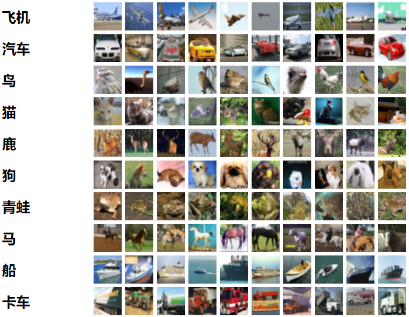
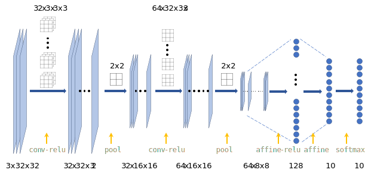
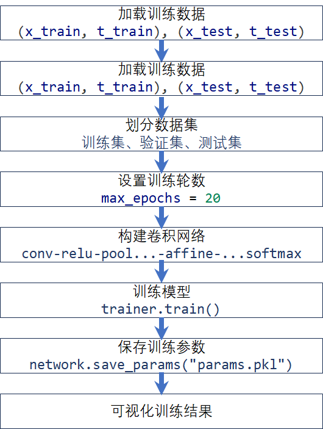
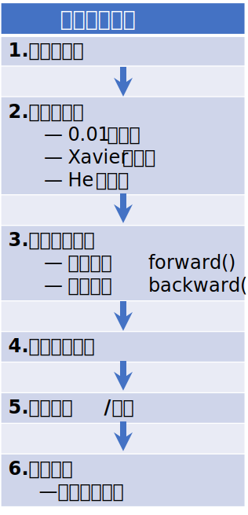
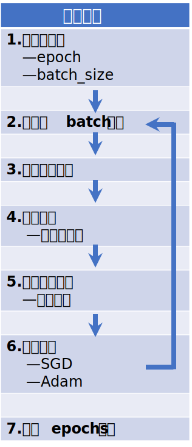
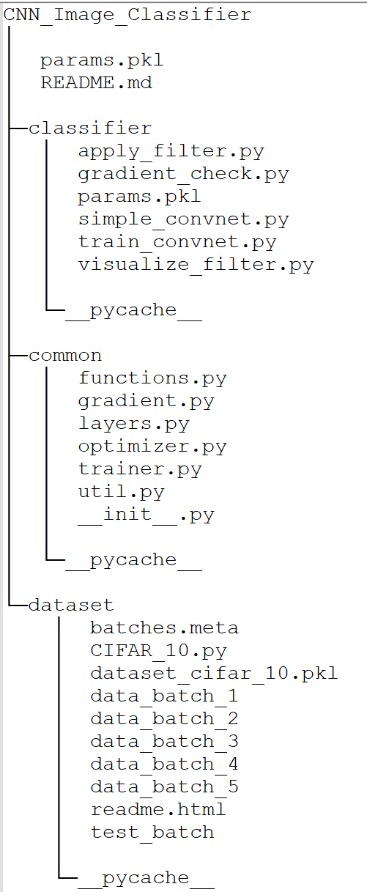
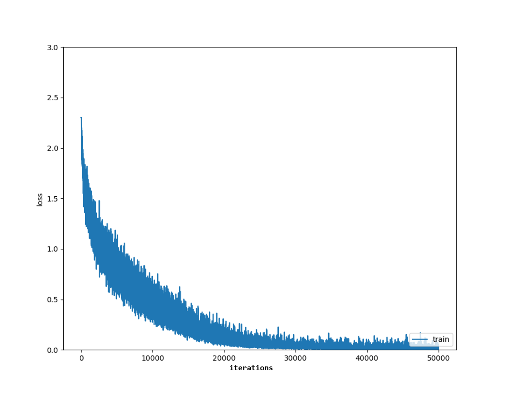
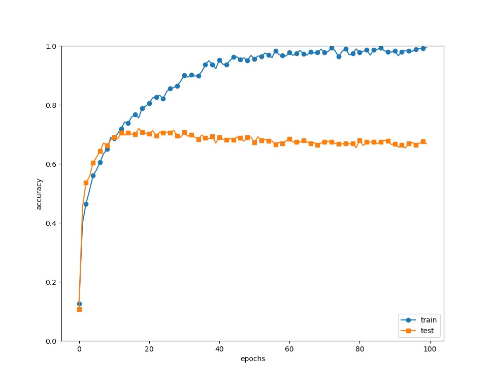
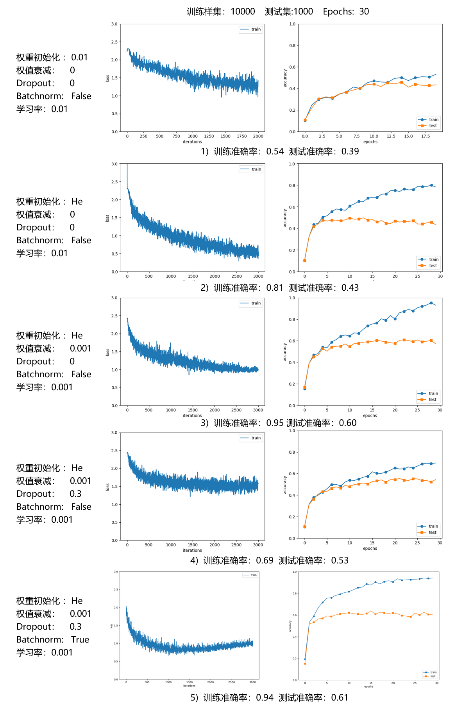
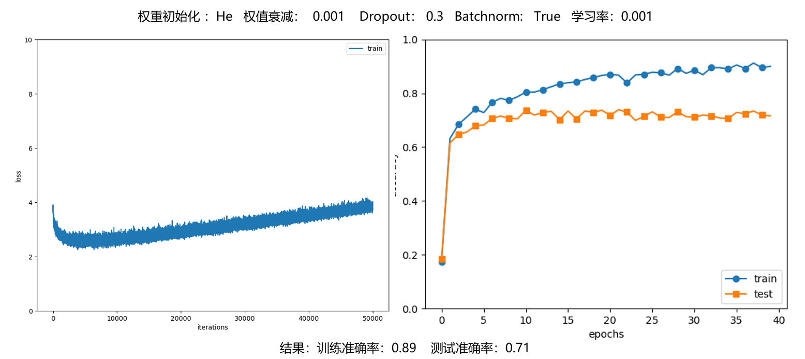

# 实现一个卷积神经网络

# 一、实验目标

实现一个简单卷积神经网络，在选定的数据集进行训练和测试。

1、学习卷积神经网络的基本原理，根据数据集识别任务搭建卷积神经网络框架

2、学习卷积、池化、激活、前向传播、反向传播等方法的基本原理和算法实现

3、学习参数、超参数的设置和优化方法，调整参数使模型识别精度得到提高

4、分析卷积神经网络算法复杂度受影响的可能因素，并思考与传统算法分析的异同

# 二、数据集介绍

<https://www.cs.toronto.edu/~kriz/cifar.html>

CIFAR-10 dataset，整个数据集有10类共60000张 32x32 的彩色图片。

数据集分成了5个训练集和1个测试集，每个都有10000张图片。测试集包含从每个类别中随机选择的 1000 张图像。训练集以随机顺序包含剩余图像，但某些训练集可能包含来自一个类别的图像多于另一类别的图像。



5个训练集（名为data\_batch\_1\~data\_batch\_5）和1个测试集（名为test\_batch）都是使用cPickle生成的 Python“pickled”对象。可以用unpickle打开并返回一个字典，字典中包含以下的元素：

**data**-- 是一个10000x3072 的 numpy array。每一行是一张 32x32 的图片。

每一行前 1024 个是 red 通道，然后是green和blue，每个通道是按行优先排列的。

**labels**-- 是一个以为数组，长度为 10000， 每个元素为 一个0\~9 之间的数，顺序与 data 对应。

数据集中有一个 batches.meta 文件，保存图片类别标签对应的名称。也包含一个字典，字典元素为

**label\_names**-- 10 个元素的一维数组，每个元素为一个名称。

# 三、数据集加载与数据预处理

按以下步骤进行数据加载。

1.  创建名为dataset 的字典 {'train\_img’: xxx, 'train\_label’: xxx, ‘test\_img’: xxx, ‘test\_label’: xxx, }
2.  读取数据集Python“pickled”文件，按结构将数据存入dataset字典
3.  将dataset字典写入一个名为 dataset\_cifar\_10.pkl 的文件，这样就把数据写入这个文件中，后续使用时从这个文件读取。

按以下步骤进行数据预处理。

1.  读取dataset\_cifar\_10.pkl这个文件
2.  按实际需求进行如下操作：
    1.  选择是否将图像像素数据标准化，0\~255转成 0\~1
    2.  选择是否将图像标签转化成One-hot编码，将标签转成One-hot形式
    3.  选择是否展平数据，将图像按批量、通道、行、列 展平

# 四、卷积神经网络的结构



模型由2个卷积层，两个池化层，1个全连接层，1个输出层，1个softmax 层组成。每个层输入、输出神经元的数量，及每层采用的参数数量大小如下表所示。采用mini - batch 进行训练，每个batch size为N。

|          | 输入         | 参数                                                              | 输出         |
| -------- | ---------- | --------------------------------------------------------------- | ---------- |
| 卷积层1     | Nx3x32x32  | Filter size：32x3x3x3&#xA;padding: 1&#xA;stride: 1               | Nx32x32x32 |
| 激活层1     | Nx32x32x32 | ReLU                                                            | Nx32x32x32 |
| 池化层1     | Nx32x32x32 | Max池化&#xA;Filtersize：2x2&#xA;padding: 0&#xA;stride: 2           | Nx32x16x16 |
| 卷积层2     | Nx32x16x16 | Filter size：64x32x3x3&#xA;padding: 1&#xA;stride: 1              | Nx64x16x16 |
| 激活层2     | Nx64x16x16 | ReLU                                                            | Nx64x16x16 |
| 池化层2     | Nx64x16x16 | Nx64x16x16Max池化&#xA;Filtersize：2x2&#xA;padding: 0&#xA;stride: 2 | Nx64x8x8   |
| 全连接层     | Nx64x8x8   | A = WX + B                                                      | Nx128      |
| 激活层3     | Nx128      | ReLU                                                            | Nx128      |
| 输出层      | Nx128      | A = WX + B                                                      | Nx10       |
| softmax层 | Nx10       | softmax                                                         | Nx10       |

# 五、模型程序实现

## 1、程序流程

程序流程图如下：



构建卷积网络的程序结构如下：



训练模型的过程如下：



## 2、程序实现

### 项目文件结构介绍

项目文件的结构树如下图所示。



1.  dataset 文件夹保存下载的数据集文件，CIFAR\_10.py 包含加载和预处理数据的功能。
2.  common 文件夹包含基本的功能模块。

    functions.py 包含 Sigmoid、ReLU、softmax 等函数实现；

    gradient.py包含包含梯度计算的函数；

    layers.py包含卷积层、池化层、激活层、全连接层等初始化和前向传播、梯度计算的实现；

    optimizer.py包含SGD、Momentum、Adam 等参数优化方法；

    trainer.py实现了迭代训练的控制；

    util.py包含卷积功能矩阵展开等功能。
3.  classifier 文件夹包含主函数和可视化的功能

    simple\_convnet.py 将各种层按顺序组装形成一个卷积网络

    train\_convnet.py 是程序的主流程，组织算法的整个过程。

### 主要实现代码

\*\*train\_convnet.py \*\*​

```python
 # coding: utf-8
import sys, os
#sys.path.append(os.pardir)  # 为了导入父目录的文件而进行的设定  失效，用下面代替
dir_path = os.path.dirname(os.path.realpath(__file__))
parent_dir_path = os.path.abspath(os.path.join(dir_path, os.pardir))
sys.path.insert(0, parent_dir_path)
import numpy as np
import matplotlib.pyplot as plt
from dataset.CIFAR_10 import load_dataset
from simple_convnet import SimpleConvNet
from common.trainer import Trainer
from common.util import shuffle_dataset

# 读入数据
(x_train, t_train), (x_test, t_test) = load_dataset(flatten=False)

# 处理花费时间较长的情况下减少数据 
x_train, t_train = shuffle_dataset(x_train, t_train) # 打乱数据集，不需要，后边用随机批量训练的
x_test, t_test = shuffle_dataset(x_test, t_test)
x_train, t_train = x_train[:10000], t_train[:10000]
x_test, t_test = x_test[:1000], t_test[:1000]

max_epochs = 2 #原 20  # 训练轮数

network = SimpleConvNet(input_dim_1=(3,32,32), input_dim_2=(32, 16, 16), 
                        conv_param = {'filter_num_1':32, 'filter_size_1':3, 'pad_1':1, 'stride_1':1, 
                                    'filter_num_2':64, 'filter_size_2':3, 'pad_2':1, 'stride_2':1, },
                        hidden_size=128, output_size=10, weight_init_std=0.01)
                        
trainer = Trainer(network, x_train, t_train, x_test, t_test,
                  epochs=max_epochs, mini_batch_size=100,
                  optimizer='Adam', optimizer_param={'lr': 0.001},
                  evaluate_sample_num_per_epoch=1000)
trainer.train()
trainer.save_results()

# 保存参数
network.save_params("params.pkl")
print("Saved Network Parameters!")

# 绘制图形
markers = {'train': 'o', 'test': 's'}
x = np.arange(max_epochs)
plt.plot(x, trainer.train_acc_list, marker='o', label='train', markevery=2)
plt.plot(x, trainer.test_acc_list, marker='s', label='test', markevery=2)
plt.xlabel("epochs")
plt.ylabel("accuracy")
plt.ylim(0, 1.0)
plt.legend(loc='lower right')
plt.show()

```

其余代码见项目文件。

# 六、初始训练结果

以全部50000张图片为训练集，1000张测试图片为测试集，对模型进行训练。训练过程中，损失和正确率变化情况如下图所示。



上图：训练过程损失变化情况



上图：训练精度和测试精度变化情况

# 七、提高图像分类准确率

跟据上面的测试结果，模型的训练精度最终接近100%，测试精度最终65%。可以从以下几个方面减少过拟合，提高模型泛化性能。

-   **权值衰减**

    该方法通过在学习的过程中对大的权重进行惩罚，来抑制过拟合。
-   **Dropout**

    Dropout 是一种在学习的过程中随机删除神经元的方法。训练时，随机选出隐藏层的神经元，然后将其删除，被删除的神经元不再进行信号的传递。
-   **Batch Normalization**

    是一种数据标准化方法，能够提升模型的拟合能力。对神经网络的每一层的输入数据都进行正则化处理，这样有利于让数据的分布更加均匀。

## 1、添加权值衰减

在损失含函数中加入正则项：

```python
def loss(self, x, t): # x 是输入的图像，函数内部的 y 是输出向量，t 是训练标签
    """求损失函数
    参数x是输入数据、t是训练标签
    """
    y = self.predict(x)

    weight_decay = 0  # 正则化 weight decay
    for idx in range(1, 5):
        W = self.params['W' + str(idx)]
        weight_decay += 0.5 * self.weight_decay_lambda * np.sum(W ** 2)

    return self.last_layer.forward(y, t) + weight_decay # 加入正则项
```

## 2、添加**Batch Normalization** 和 **Dropout**

1）添加优化过拟合的参数

```python
# 加入优化过拟合的方法=================================
# 设定 weight decay 的强度
weight_decay_lambda = 0.1
# 设定是否使用Dropuout，以及比例 
use_dropout = True  # 不使用Dropout的情况下为False
dropout_ration = 0.2
# 设定是否使用 batchnorm 
use_batchnorm = True
# ====================================================
network = SimpleConvNet(input_dim_1=(3,32,32), input_dim_2=(32, 16, 16), 
           conv_param = {'filter_num_1':32, 'filter_size_1':3, 'pad_1':1, 'stride_1':1, 
    'filter_num_2':64, 'filter_size_2':3, 'pad_2':1, 'stride_2':1, },hidden_size=128, 
    output_size=10, weight_init_std='he', weight_decay_lambda = weight_decay_lambda,
 use_dropout = use_dropout, dropout_ration = dropout_ration, use_batchnorm=use_batchnorm) # 加入
```

2）在中间层之间添加 Batch Normalization 和 Dropout层：

```python
  # 生成层
  hidden_size_list = [32768, 16384, 128]
  self.use_batchnorm = use_batchnorm
  self.use_dropout = use_dropout
  self.dropout_ration = dropout_ration
  self.layers = OrderedDict() # 一个有顺序的字典，使用时按顺序传播
  # 卷积层1  =============
  self.layers['Conv1'] = Convolution(self.params['W1'], self.params['b1'],
                                     conv_param['stride_1'], conv_param['pad_1'])
  
  # batchnorm层1  =============
  if self.use_batchnorm:  # 第一层的 batchnorm
      self.params['gamma1'] = np.ones(hidden_size_list[0])
      self.params['beta1'] = np.zeros(hidden_size_list[0])
      self.layers['BatchNorm1'] = BatchNormalization(self.params['gamma1'], 
                                                     self.params['beta1'])    
  # Relu层1  =============
  self.layers['Relu1'] = Relu()
  
  # dropout层1  =============
  if self.use_dropout:  # 第一层的 dropout
      self.layers['Dropout1'] = Dropout(dropout_ration)
  
  # 池化层1  =============
  self.layers['Pool1'] = Pooling(pool_h=2, pool_w=2, stride=2) # 池化2x2, 步长为2 
  
  # 卷积层2  =============
  self.layers['Conv2'] = Convolution(self.params['W2'], self.params['b2'],
                                     conv_param['stride_2'], conv_param['pad_2'])
  
  # batchnorm层2  =============
  if self.use_batchnorm:  # 第二层的 batchnorm
      self.params['gamma2'] = np.ones(hidden_size_list[1])
      self.params['beta2'] = np.zeros(hidden_size_list[1])
      self.layers['BatchNorm2'] = BatchNormalization(self.params['gamma2'], 
                                                      self.params['beta2'])  
  # Relu层2  =============
  self.layers['Relu2'] = Relu()
  
  # dropout层2  =============
  if self.use_dropout:  # 第二层的 dropout
      self.layers['Dropout2'] = Dropout(dropout_ration)
  
  # 池化层2  =============
  self.layers['Pool2'] = Pooling(pool_h=2, pool_w=2, stride=2) # 池化2x2, 步长为2
  
  # 全连接层1  =============
  self.layers['Affine1'] = Affine(self.params['W3'], self.params['b3'])
  
  # batchnorm层3  =============
  if self.use_batchnorm:  # 第三层的 batchnorm
      self.params['gamma3'] = np.ones(hidden_size_list[2])
      self.params['beta3'] = np.zeros(hidden_size_list[2])
      self.layers['BatchNorm3'] = BatchNormalization(self.params['gamma3'], 
                                                      self.params['beta3'])  
  
  # Relu层3  =============
  self.layers['Relu3'] = Relu()
  
  # dropout层3  =============
  if self.use_dropout:  # 第三层的 dropout
      self.layers['Dropout3'] = Dropout(dropout_ration)
  
  # 全连接层2  =============
  self.layers['Affine2'] = Affine(self.params['W4'], self.params['b4'])
  
  self.last_layer = SoftmaxWithLoss() # softmax 前向传播、后向传播的函数, 计算出Loss
```

## 3、再次训练

添加避免过拟合的手段后，重新对模型进行训练，训练和测试结果如下所示：



用全部训练样本进行一次训练，最终结果如下：



进行50轮训练：最终结果训练精度 0.89    测试精度0.71。测试精度有所上升，过拟合程度有所下降。

# 八、算法复杂度分析

分析卷积神经网络算法复杂度受影响的因素，并思考与传统算法分析的异同

## **1. 时间复杂度**受影响的因素

从卷积神经网络的结构和计算方式，网络的计算主要是矩阵运算。矩阵运算计算的次数，由矩阵的大小决定。输入图片的像素数量、通道数，卷积核的大小，数量，池化的大小，隐藏层神经元的个数，以及卷积层、全连接层的层数等，是影响计算量的主要因素。

在训练样本个数固定的情况下，训练轮数直接决定训练时间。

卷积神经网络模型的复杂度，可用 FLOPs 衡量，也就是浮点运算次数（FLoating-point OPerations）来衡量。需要的计算次数越大，模型越复杂。

> **1.1 单个卷积层的时间复杂度**

$$
\quad\quad\quad\quad\quad\quad\quad\quad\quad\textbf{Time} \sim O(M^2 \cdot K^2 \cdot C_{in} \cdot C_{out})\quad\quad\quad\quad\quad\quad\quad\quad\quad
$$

-   $M$ : 每个卷积核**输出**特征图的边长
-   $K$: 每个卷积核的边长
-   $C_{in}$: 每个卷积核的通道数，也即输入通道数，也即上一层的输出通道数。
-   $C_{out}$: 本卷积层具有的卷积核个数，也即输出通道数。
-   可见，每个卷积层的时间复杂度由**输出**特征图面积 $M^{2}$、卷积核面积 $K^{2}$ 、输入$C_{in}$和输出通道数 $C_{out}$完全决定。
-   其中，**输出**特征图尺寸本身又由**输入**矩阵尺寸 $X$ 、卷积核尺寸 $K$、$Padding$、$Stride$这四个参数所决定，如下所示：
    $$
    M=(X-K+2*Padding)/Stride+1
    $$
-   注1：为了简化表达式中的变量个数，这里统一假设输入和卷积核的形状都是正方形。
-   注2：严格来讲每层应该还包含 1 个 $Bias$参数，这里为了简洁就省略了。

> **1.2 卷积神经网络整体的时间复杂度**

$$
Time \sim O(\sum_{l=1}^{D}{M_{l}^{2}}\cdot{K_{l}^{2}}\cdot{C_{l-1}}\cdot{C_{l}})
$$

-   $D$ 神经网络所具有的卷积层数，也即**网络的深度**。
-   $l$ 神经网络第$l$个卷积层
-   $C_{l}$神经网络第 $l$个卷积层的输出通道数$C_{out}$，也即该层的卷积核个数。
-   对于第$l$ 个卷积层而言，其输入通道数$C_{in}$就是第 ($l$ −1) 个卷积层的输出通道数。

## **2. 空间复杂度**的影响因素

卷积神经网络需要存储的数据包括两部分：总参数量 + 各层输出特征图。

-   **参数量**：模型所有带参数的层的权重参数总量
-   **特征图**：模型在实时运行过程中每层所计算出的输出特征图大小

$$
\textbf{Space} \sim O\Bigg(\sum_{l=1}^{D} K_l^2 \cdot C_{l-1} \cdot C_{l} + \sum_{l=1}^{D} M^2 \cdot C_l \Bigg)
$$

-   总参数量只与卷积核的尺寸$K$、通道数$ C  $ 、层数$D$ 相关，而**与输入数据的大小无关**。
-   输出特征图的空间占用，就是其空间尺寸$M^{2}$和通道数 $C$的连乘。
